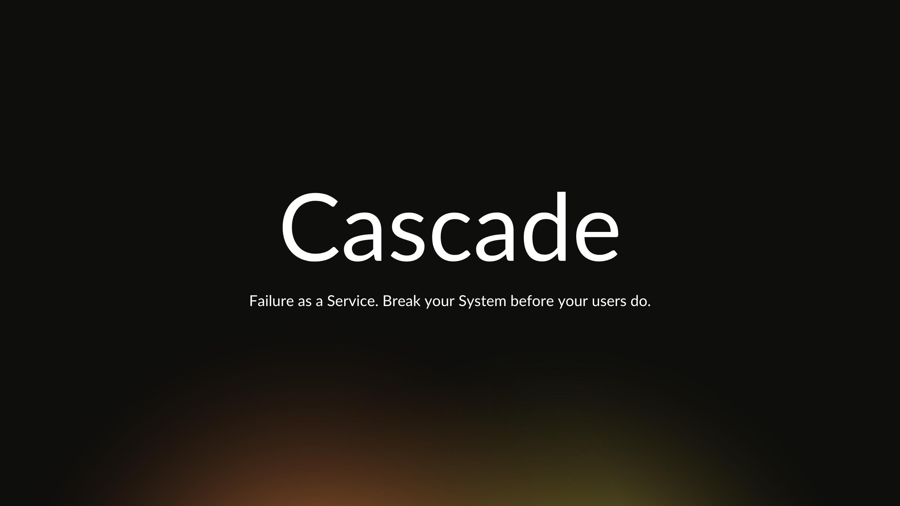

Ever had that sinking feeling of your system going down at 3 AM? Yeah, me too. It sucks. With distributed systems, failures aren't an exception, they're the norm.

But what if I told you that failures could be a feature and not a bug. Enter Cascade. We break things on purpose so they don't break by accident. Simple as that!

Cascade pushes your deployments to the brink and helps you patch them up. All before your users even notice.


But Cascade doesn't just break things and leave you to pick up the pieces. Oh no. We're not savages. (well, maybe a little).

Cascade lets you simulate these scenarios in a controlled environment. Crash and burn all you want - no real users harmed in the process.

Netflix uses chaos engineering to ensure your binge-watching is never interrupted.
Zomato uses it to keep your impulsive orders flowing 24/7.
Even NASA uses it. Yeah, freaking NASA boi.

If it's good enough for rocket scientists, it's prolly good enough for your app too.

## Principles

Chaos Engineering involves inducing controlled failures in a system to observe how it responds under stress conditions.

Cascade facilitates chaos experiments to test the resiliency and recovery capabilities of Kubernetes applications through controlled disruptions.

This following section outlines the configurations, scenarios, and executions available in Cascade. The project is a WIP but changes would always be backwards compatible.

## Scenario
A Scenario organizes chaos experiments with specific configurations:

- Target: Defines the resources (namespaces, pods, nodes) to target for chaos experiments.
- Runtime: Specifies runtime parameters such as interval, grace period, ratio, and execution modes.
- Interface: Determines how chaos events are handled, including synchronous/asynchronous execution and event logging options.


### Target
Configure specific targets for chaos experiments using a combination of namespaces, labels, selectors, and resource types.

| Field             | Description                                              | Example Value                |
|-------------------|----------------------------------------------------------|------------------------------|
| `Namespaces`      | A selector for namespaces to restrict chaos experiments. | `labels.Selector` instance   |
| `IncludedPodNames`| Names of specific pods to include in chaos experiments.  | `"app-1-pod, app-2-pod"`     |
| `IncludedNodeNames`| Names of specific nodes to include in pod chaos experiments. | `"node-1, node-2"`       |
| `ExcludedPodNames`| Names of specific pods to exclude from chaos experiments.  | `"app-3-pod"`                |
| `Healthcheck`     | Endpoint for health checks during chaos experiments.     | `"/healthcheck"`             |

### Runtime
Specifies runtime parameters for chaos scenarios.

| Field      | Description                                         | Example Value        |
|------------|-----------------------------------------------------|----------------------|
| `Interval` | Interval between killing pods                       | `5`    |
| `Grace`    | Grace time after which pods are terminated          | `30`                 |
| `Ratio`    | Ratio of pods to kill                               | `0.2`                |
| `Mode`     | Pod termination strategy (`ExecutionMode` enum)     | `ExecutionMode.Delete` |
| `Order`    | Pod ordering strategy (`OrderingStrategy` enum)     | `OrderingStrategy.Random` |

### Interface
Determines how chaos events are handled, including synchronous/asynchronous execution and event logging options.

| Field         | Description                                              | Example Value |
|---------------|----------------------------------------------------------|---------------|
| `Synchronous` | Determines if chaos experiments run synchronously or asynchronously. | `true`        |
| `Watch`       | Enables logging of chaos events as server-side events.   | `true`        |

## Session
A Session represents an active chaos experiment within a Scenario.

## Tests
Various tests can be conducted using Cascade to validate system resilience and recovery capabilities:

Pod Termination: Simulates failure scenarios by terminating pods (e.g., Delete Pods, Evict Pods).

- Significance: Tests application resilience to sudden pod failures and Kubernetes' ability to recover.

Node Disruption*:

- Node Drain: Evicts all pods from a node to test workload migration and cluster stability.
- Node Restart: Restarts a node to simulate node failures and observe application behavior.
- Node Taint: Applies taints to nodes to simulate degraded node conditions.

Container Failure*:

- Docker Service Kill: Simulates failure scenarios by killing Docker services or individual containers.

Cluster-wide Disruptions*:

- ETCD Disruption: Disrupts the ETCD cluster to test Kubernetes control plane resilience.
- API Server Breakdown: Induces failures in the Kubernetes API server to validate control plane recovery.
- Network Partition: Simulates network failures within the cluster to observe network resilience and service discovery.

*WIP

## CLI

Cascade CLI is a powerful tool for orchestrating chaos engineering experiments in Kubernetes clusters. It provides an intuitive interface for creating, managing, and executing chaos scenarios, helping you build more resilient systems.

## Usage

### Building the CLI

To build the Cascade CLI, ensure you clone the repo and then run:

```bash
make cli
```

This compiles and builds the Cascade CLI

### Starting the API Server

To start the API server capable of triggering chaos engineering tests on any given Kubernetes cluster, use:

```bash
cascade serve start
```

This command initializes the server, allowing you to interact with it via API calls or other Cascade CLI commands.

### Stopping the API Server

To stop the API server and clean up resources, use:

```bash
cascade serve stop
```

This command gracefully shuts down the server and removes any associated Docker containers.

### Creating a Chaos Scenario

To create a new chaos engineering scenario, run:

```bash
cascade create
```
This interactive command walks you through the process of defining a chaos scenario, including target selection, fault injection parameters, and execution strategies.

### Executing a Chaos Scenario

To execute an existing chaos scenario in a stateful manner use the API or use CLI for stateful runs:

```bash
cascade exec
```
This command guides you through selecting and triggering a predefined chaos engineering scenario on your target Kubernetes cluster.

## Configuration

Cascade CLI uses a YAML configuration file to store settings and scenario definitions. By default, it looks for a `config.yaml` file in the current directory.

Example configuration:

```yaml
scenario:
  # Name of the chaos experiment
  id: scenario
  # Description of the chaos experiment
  description: this is a sample scenario
# Defines the targets for chaos experiment
target:
  # Namespace or set of namespaces to target
  namespaces: test
  # Pods would become chaos experiment target if they contain the given string in their name
  includedPodNames: chaos
  # Pods would not become chaos experiment target if they reside on a node which contain the given string in their name
  includedNodeNames: chaos
  # Pods would be spared from chaos experiment if they contain the given string in their pod name
  excludedPodNames: chaos
# Defines the session attributes for the given chaos experiment
runtime:
  # Intervals at which the chaos experiments are to be triggered, defaults to 10m
  interval: 10m
  # The grace time before the chaos experiment starts, defaults to 1m
  grace: 1m
  # The execution strategy for the chaos experiment, options include evict, delete, dry-run, defaults to delete
  mode: dry-run
  # Pod ordering strategy for chaos experiments, options include oldest, youngest, cost, random, defaults to random
  ordering: default
  # Ratio of candidate pods to be targeted for chaos experiment, defaults to 0.5
  ratio: 0.5
# Defines the cluster attributes for the given chaos experiment
cluster:
  # Path to the kubeconfig file
  kubeconfig: "/path/to/kubeconfig"
  # Path to the master configuration file
  master: "https://master.example.com"
  # Type of origin, could be one of the following: host, cluster, defaults to host
  origin: host
  # Health check port for the pods
  healthcheck: ":8080"
```

## Dockerfile

This section provides an overview of the Dockerfile for cascade.

### Purpose
The Dockerfile is used to define the instructions for building a Docker image. It specifies the base image, installs dependencies, sets environment variables, and configures the container.

We utilize a multi-stage build for both development and production environments. The development stage includes auto-reload functionality backed by air, allowing for seamless code changes during development. Additionally, we have a Docker Compose configuration that includes a PostgreSQL container for database management.


### Usage
To build the Docker image for development, navigate to the directory containing the Dockerfile and run the following command:

```bash
docker build --target development -t cascade:dev .
```

To build the Docker image for production, use the following command:

```bash
docker build --target production -t cascade:prod .
```

To use the docker compose

```bash
docker compose up -d --build
```

For compose teardown

```bash
docker compose down -v
```

### Customization
Feel free to modify the Dockerfile to suit your specific needs. You can add additional dependencies, configure ports, or include any other necessary instructions.

### Maintenance
Please ensure that the Dockerfile is kept up to date with any changes or updates to your application. Regularly review and test the Dockerfile to ensure it builds the desired image correctly.

## Contributing

Feel free to contribute to Cascade by sending us your suggestions, bug
reports, or cat videos. Contributions are what make the open source community
such an amazing place to be learn, inspire, and create. Any contributions you
make are **greatly appreciated**.

## License

Distributed under the MIT License. See [LICENSE](LICENSE) for more information.
Cascade is provided "as is" and comes with absolutely no guarantees.
If it breaks your system, well, that's kind of the point, isn't it? Congratulations, you're now doing chaos engineering!

Use at your own risk. Side effects may include improved system resilience, fewer 3 AM panic attacks, and an irresistible urge to push big red buttons.

## Credits

Created by an engineer who wants to take down prod, loves to break things for a living and sleep soundly at night.
Special thanks to Murphy's Law for the constant inspiration.
